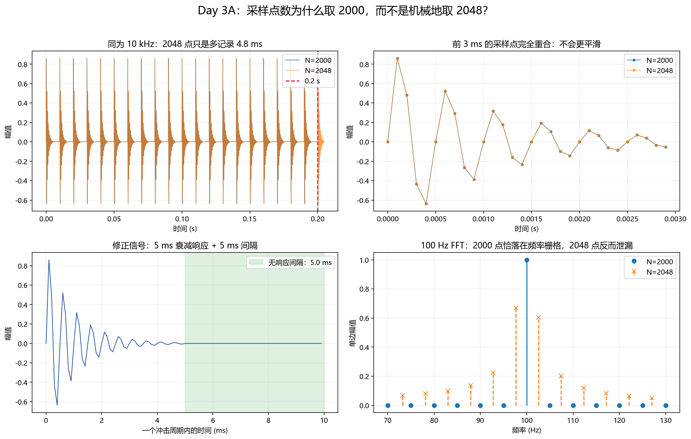
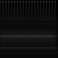

# Day 3：从冲击信号到 96×96 图像（V1.1 易读版）

> 日期：2026-08-31  
> 状态：完成  
> 使用方法：按 A → B → C 阅读。每一段只解决一个问题，完成段末自检后再继续。  
> 版本说明：V1 原文件保留；V1.1 修正冲击重叠问题，并降低知识跨度。

## 今天只走三步

```text
Day 3A：先看懂模拟信号为什么取 2000 点
    ↓
Day 3B：只看 CWT 系数如何变成 [0,1] 强度矩阵
    ↓
Day 3C：只看强度矩阵如何保存成 96×96 灰度图
```

今天暂时不学习：

- z-score；
- 32×32 与 96×96 的分类性能比较；
- CNN 参数量推导；
- PyTorch、Dataset、DataLoader；
- CWRU 真实数据。

---

# Day 3A：采样点数为什么取 2000？

## A1. 本段唯一问题

> `N=2048=2^11` 会不会比 `N=2000` 更平滑？

先预测：如果采样率都保持 10 kHz，2048 点的采样间隔会不会变小？

## A2. 先分清四个量

```text
采样率 fs：每秒取多少个点
采样间隔 Δt：相邻两个点相隔多久，Δt=1/fs
采样点数 N：一共记录多少个点
记录时长 T：T=N/fs
```

当 `fs=10,000 Hz` 不变时：

| 参数 | N=2000 | N=2048 |
|---|---:|---:|
| 采样间隔 Δt | 0.1 ms | 0.1 ms |
| 记录时长 T | 0.2000 s | 0.2048 s |
| 2000 Hz 每周期采样点 | 5 | 5 |

观察：两个信号前 2000 个采样点完全相同。2048 点只是在末尾多记录了 48 点，也就是 4.8 ms。

因此：

> 在采样率不变时，2048 不会让局部波形更平滑，只会让记录时间更长。



## A3. 为什么 FFT 常见 2 的整数次幂？

`1024、2048、4096` 适合基2 FFT，计算通常很方便。但“计算方便”和“波形更平滑”不是同一件事。

2000 也不是难处理的长度：

```text
2000 = 2^4 × 5^3
```

现代 FFT 可以高效处理这种混合基数长度。

当前参数还有一个教学优势：

```text
fs = 10000 Hz
N = 2000
Δf = fs/N = 5 Hz
```

所以：

```text
100 Hz  = 第 20 个频率间隔
2000 Hz = 第 400 个频率间隔
```

两个频率都正好落在 FFT 频率栅格上。

若保持 `fs=10000 Hz` 改成 `N=2048`：

```text
Δf = 4.8828125 Hz
100/Δf = 20.48
2000/Δf = 409.6
```

频率反而不落在整数频点上，100 Hz 正弦的 FFT 会出现泄漏。上图右下角已经验证这一点。

## A4. 真正让波形更平滑的是什么？

关键量是：

```text
每周期采样点数 = fs / 信号频率
```

当前 2000 Hz 振荡只有：

```text
10000 / 2000 = 5 点/周期
```

如果希望振荡看起来明显更平滑，应提高采样率。例如：

```text
fs = 20000 Hz → 10 点/周期
```

如果仍记录 0.2 s，此时应取 `N=4000`。这才是真正增加采样密度。

## A5. 修正旧信号的冲击重叠

旧信号设置为：

```text
冲击周期 = 10 ms
每段响应 = 20 ms
```

下一次冲击发生时，前一次响应还没有结束，所以旧信号的相邻响应会重叠。“冲击之间有间隔”的描述不准确。

V1.1 新建 `signal2_bearing_impact_V3.npy`，不覆盖旧文件。新参数为：

| 参数 | V1.1 数值 |
|---|---:|
| 采样率 | 10,000 Hz |
| 点数 | 2,000 |
| 时长 | 0.2 s |
| 冲击频率 | 100 Hz |
| 冲击周期 | 10 ms |
| 每段衰减响应 | 5 ms |
| 无响应间隔 | 5 ms |
| 固有频率 | 2,000 Hz |
| 阻尼系数 | 1,000 |

现在每个周期明确分成：

```text
5 ms 衰减振荡 + 5 ms 零信号间隔
```

这只是为了建立直觉的简化教学信号，不是真实轴承振动，也不是论文给出的数据模型。

## A6. 本段只记三句话

1. 2 的整数次幂主要方便 FFT，不会天然使时域信号更平滑。
2. 同一采样率下，2000 与 2048 的采样间隔相同；2048 只是时间更长。
3. 要让 2000 Hz 振荡更平滑，应提高采样率，而不是只增加记录点数。

### A段自检

1. `fs` 不变时，从 2000 改成 2048，改变的是采样间隔还是记录时长？
2. 想让每个 2000 Hz 周期拥有更多采样点，应该主要改变 `N` 还是 `fs`？

答案：记录时长；提高 `fs`。

> 到这里可以停下来。A段没有读顺之前，不进入B段。

---

# Day 3B：CWT 系数怎样变成强度矩阵？

## B1. 本段唯一问题

> CWT 输出的正负系数怎样变成一张非负的强弱分布图？

先预测：如果同一位置的系数分别为 `-0.8` 和 `+0.8`，它们的匹配强弱是否相同？

## B2. 第一步：计算 CWT

```python
scales = np.arange(1, 129)
coefficients, frequencies = pywt.cwt(
    signal,
    scales,
    "morl",
    sampling_period=1 / 10000,
)
```

输出：

```text
coefficients.shape = (128, 2000)
```

只需理解两个维度：

```text
128  = 128 个 scale
2000 = 2000 个时间点
```

矩阵中每个元素表示：某个 scale 的小波在某个时间点与信号的匹配系数。

## B3. 第二步：取绝对值

```python
magnitude = np.abs(coefficients)
```

取绝对值以后：

- 所有数值都非负；
- 正负相位不再影响“强弱”显示；
- 数值越大，表示匹配越强。

`-0.8` 和 `+0.8` 取绝对值后都是 `0.8`，所以匹配强度相同。

## B4. 第三步：min-max

```python
normalized = (magnitude - magnitude.min()) / (
    magnitude.max() - magnitude.min()
)
```

结果范围变为 `[0,1]`：

```text
0 → 当前样本中最弱的位置
1 → 当前样本中最强的位置
```

Min-max 只改变数值尺度，不移动图案的位置。


## B5. 本段只记三句话

1. CWT 输出 shape 是 `scale × time`。
2. `abs()` 把有正负号的系数变成非负匹配强度。
3. min-max 把强度范围变为 `[0,1]`，但不改变纹理位置。

### B段自检

1. `(128,2000)` 的两个维度分别是什么？
2. min-max 会增加CWT的时间分辨率吗？

答案：scale和时间点；不会。

> 到这里可以停下来。B段不讨论PNG、颜色通道或CNN。

---

# Day 3C：强度矩阵怎样保存成 96×96 图片？

## C1. 本段唯一问题

> 怎样把 `(128,2000)` 的 `[0,1]` 浮点矩阵，保存成没有坐标轴和色条的 96×96 灰度PNG？

先预测：如果直接把带标题、坐标轴和颜色条的 Matplotlib 整张图保存给模型，模型可能学到什么无关内容？

## C2. 第一步：双线性缩放

论文明确说明使用 bilinear interpolation 缩放图像。因此 V1.1 固定：

```python
Image.Resampling.BILINEAR
```

处理顺序：

```text
(128,2000) 浮点强度矩阵
    ↓ 双线性缩放
(96,96) 浮点强度矩阵
```

双线性缩放会综合附近像素计算新像素。它会损失一些细节，但不会裁掉某一段时间。

## C3. 第二步：转换成8位灰度

```python
image_uint8 = np.rint(resized * 255).astype(np.uint8)
```

`uint8`允许的整数范围为0~255。

本次缩小会平均尖锐峰值，因此最终图片实际范围是0~88，并不要求一定同时出现0和255；关键是所有像素都合法且生成规则一致。

## C4. 第三步：直接保存像素矩阵

```python
Image.fromarray(image_uint8, mode="L").save(output_path)
```

`L` 表示单通道灰度。正式PNG不包含：

- 标题；
- 坐标轴；
- 刻度；
- 色条；
- 白色边距。

伪彩色图只用于人眼观察。正式模型图由同一个强度矩阵保存为灰度。


### 正式96×96输入图



## C5. 本段只记三句话

1. 双线性插值把整个 `(128,2000)` 矩阵缩放到 `(96,96)`，不是裁剪。
2. `uint8` 把浮点强度编码成0~255范围内的整数。
3. 正式输入用Pillow直接保存为 `L` 模式，不能把带坐标轴的讲解图交给模型。

### C段自检

1. 双线性缩放和裁剪有什么区别？
2. 为什么不能把讲解图直接作为模型输入？

答案：缩放保留全图并压缩，裁剪只保留局部；讲解图包含文字、坐标和边框等无关模式。

---

# 完成检查

如果能用自己的话解释下面三条，Day 3 就算完成：

```text
为什么 N=2000 不会比 N=2048 更“不平滑”
为什么 CWT 系数要 abs() 后再 min-max
为什么正式 PNG 不能带坐标轴和色条
```

## V1.1 相对 V1 的改动

| 反馈 | V1.1处理 |
|---|---|
| 没有解释为什么取2000点 | 增加2000/2048可观察实验 |
| 把2的幂误认为更平滑 | 区分FFT效率、采样率和记录时长 |
| 旧响应段长于冲击周期 | 新建V3信号，改为5 ms响应+5 ms间隔 |
| 一节同时出现太多概念 | 拆成A/B/C，每段只有一个问题 |
| z-score增加负担 | 从主线移除 |
| CNN参数量推导跨度太大 | 移到Day 4以后，不在本节展开 |
| 32×32比较打断主线 | 暂时移除，只保留96×96闭环 |

## 文件清单

### 修正后的教学信号

- `paper/04_experiments/signal2_bearing_impact_V3.npy`

### 实验脚本

- `paper/04_experiments/day3_v1_1_learning_experiment.py`

### 三张分段教学图

- `paper/04_experiments/day3A_sampling_length_comparison_V1.1.png`
- `paper/04_experiments/day3B_cwt_magnitude_minmax_V1.1.png`
- `paper/04_experiments/day3C_image_generation_V1.1.png`

### 正式输入图

- `paper/04_experiments/day3_scalogram_96x96_V1.1.png`

---

**Day 3 V1.1 状态：完成。阅读时不要求一次看完，按A、B、C分三次完成即可。**
