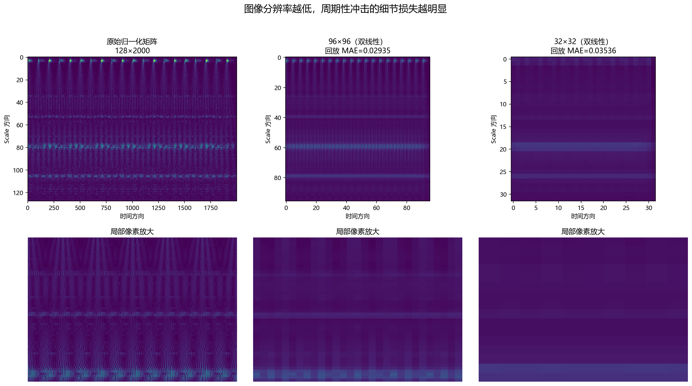
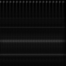

# Day 3：从 CWT 系数到 CNN 输入图像（V1）

> 日期：2026-08-25  
> 状态：完成  
> 今日边界：只完成模拟轴承冲击信号的图像生成闭环，不下载 CWRU，不进入 PyTorch、Dataset、DataLoader 或 CNN。

## 一、今天要解决的问题

Day 2 已经回答了两个问题：

1. CWT 输出为什么是二维矩阵；
2. scale、frequency、time 和 coefficient 分别代表什么。

Day 3 接着回答：

1. CWT 系数矩阵怎样变成一张真正的图片？
2. 为什么要取系数绝对值？
3. 为什么要做归一化？
4. 为什么论文使用双线性插值？
5. 给人看的彩色图和给 CNN 的输入图有什么区别？
6. 怎样确认保存的 96×96 PNG 没有坐标轴、标题、色条和留白？

今天完成的最小闭环是：

```text
模拟轴承冲击信号 (2000,)
    ↓ CWT: morl, scales=1~128
CWT 系数 (128, 2000)
    ↓ 取绝对值
强度矩阵 (128, 2000)
    ↓ 逐样本 min-max
[0, 1] 浮点矩阵 (128, 2000)
    ↓ 双线性插值
96×96 浮点强度矩阵
    ↓ 量化为 uint8
96×96 单通道灰度 PNG
```


---

## 二、实验输入

本次继续使用 Day 1 已生成的改进版模拟轴承冲击信号：

| 参数 | 数值 |
|---|---:|
| 文件 | `signal2_bearing_impact_v2.npy` |
| 采样频率 | 10,000 Hz |
| 采样点数 | 2,000 |
| 时长 | 0.2 s |
| 故障冲击频率 | 100 Hz |
| 轴承固有频率 | 2,000 Hz |
| 阻尼系数 | 500 |

这个信号每 0.01 s 出现一次冲击。冲击激发 2,000 Hz 的高频振荡，并随时间指数衰减。因此它适合用于检查 CWT 是否保留了以下结构：

- 冲击发生的时间；
- 冲击重复的周期；
- 高频振荡及其衰减；
- 不同 scale 上的能量分布。

这仍然是教学信号，不代表真实 CWRU 数据。今天确定的是“转换流程”，不是最终复现参数。

---

## 三、CWT 矩阵和普通图片有什么区别？

### 3.1 CWT 矩阵是科学计算结果

使用以下参数：

```python
scales = np.arange(1, 129)
coefficients, frequencies = pywt.cwt(
    signal,
    scales,
    "morl",
    sampling_period=1 / 10000,
)
```

输出为：

```text
coefficients.shape = (128, 2000)
```

矩阵的含义是：

- 第 0 维：128 个 scale；
- 第 1 维：2,000 个时间点；
- 每个元素：该时刻的信号与该尺度 Morlet 小波的匹配程度。

它是浮点矩阵，元素可以是负数，不是 PNG，也没有“红、绿、蓝”三个颜色通道。

### 3.2 图片是矩阵的一种编码方式

一张 8 位灰度图片同样可以表示为二维矩阵：

```text
0   = 黑色
255 = 白色
中间整数 = 不同灰度
```

因此，从 CWT 到图像的本质不是“截图”，而是把科学计算矩阵稳定地映射成像素强度。

### 3.3 为什么不能把 Matplotlib 图直接截图给 CNN？

Matplotlib 讲解图通常包含：

- 标题；
- 横纵坐标；
- 刻度和文字；
- 颜色条；
- 白色边距。

如果把整张讲解图送给 CNN，CNN 可能学习边框、刻度和排版，而不是故障纹理。不同电脑的字体、DPI 和布局还会产生额外差异。

所以正式模型输入必须直接由像素矩阵保存，不能通过 `plt.savefig()` 保存整张坐标图。

---

## 四、为什么要取 CWT 系数的绝对值？

CWT 系数带正负号。正负号反映信号与小波相位、方向上的关系，但论文中的 scalogram 主要表达“哪里匹配得强”。因此本实验使用：

```python
magnitude = np.abs(coefficients)
```

绝对值越大，表示该时刻、该 scale 上的小波匹配越强；绝对值越小，匹配越弱。

本实验得到：

```text
magnitude.shape = (128, 2000)
minimum ≈ 7.913 × 10^-8
maximum ≈ 1.531
```

注意：这里说的是“小波系数幅值”，不是严格物理意义上的能量。如果使用系数平方，才更接近常见的 power 表达。为了与现有实验和论文图像强度逻辑保持一致，V1 固定使用绝对值。

---

## 五、归一化改变了什么？

本次对比三种数值表达：

### 5.1 不归一化

```python
raw = magnitude
```

优点：保留原始数值尺度。  
问题：不同信号的系数范围可能差异很大，不能直接稳定地映射到 8 位像素。

### 5.2 Min-max 归一化

```python
normalized = (x - x.min()) / (x.max() - x.min())
```

输出范围固定为 `[0, 1]`：

- 最弱位置映射到 0；
- 最强位置映射到 1；
- 其他位置按比例映射。

优点：最容易稳定地转换为 0~255 灰度。  
代价：不同样本之间的绝对幅值差异会被削弱。

### 5.3 Z-score 标准化

```python
standardized = (x - x.mean()) / x.std()
```

结果均值约为 0，标准差为 1，但仍包含负数且没有固定上下界。要保存成普通 8 位图，还必须再进行截断或映射，这会额外引入参数。

### 5.4 V1 为什么选择逐样本 min-max？

因为今天的目标是建立透明、最小、可复现的图像闭环，而不是提前优化最终分类性能。首轮方案固定为逐样本 min-max；等真实数据和 CNN 跑通后，再比较：

- 逐样本 min-max；
- 全训练集统一 min-max；
- z-score；
- 是否保留跨样本的幅值信息。


关键结论：归一化改变数值尺度，不改变高能量纹理位于哪个 scale、哪个时间点。

---

## 六、Day 2 参数结论修正：论文明确使用双线性插值

Day 2 报告把 resize 方法记录为“论文未说明”。重新核对论文原文后确认，这一点需要修正：

> 论文在 MFPT 和 CWR 两个案例中都说明，生成图像后使用 bilinear interpolation 缩放到 CNN 所需尺寸。

因此 Day 3 不再比较哪一种 resize 是正式方案，V1 直接固定：

```python
Image.Resampling.BILINEAR
```

### 6.1 双线性插值在做什么？

目标像素通常不会刚好落在原矩阵整数位置。双线性插值会参考附近四个像素，按距离加权计算新像素。

它的效果通常是：

- 比最近邻平滑；
- 不会像最近邻那样产生明显方块；
- 比双三次简单；
- 缩小图像时会损失高频细节。

### 6.2 为什么先保持浮点，再量化为 uint8？

本实验顺序是：

```text
[0,1] 浮点矩阵 → 双线性缩放 → ×255 并四舍五入 → uint8
```

如果先变成整数再缩放，会更早发生量化误差。保留浮点到最后一步，能减少不必要的信息损失。

### 6.3 96×96 和 32×32 的实验结果

把缩小后的图片重新放大到 128×2000，与原归一化矩阵计算平均绝对误差（MAE）：

| 输出尺寸 | 回放 MAE | 观察 |
|---|---:|---|
| 96×96 | 0.029348 | 周期性冲击条纹仍可辨认 |
| 32×32 | 0.035357 | 时间细节明显被平均，条纹趋于消失 |

MAE 只是教学用的近似信息损失指标，不是 CNN 分类能力指标。最终仍需通过分类准确率验证图像尺寸的影响。



---

## 七、为什么正式输入是单通道，而论文里的图看起来是彩色？

### 7.1 彩色图是给人看的伪彩色

论文 Figure 4 和 Tables 14~17 中的 scalogram 使用颜色帮助人眼区分强弱。颜色并不是传感器测得的三个独立物理通道，而是把同一个强度值查表映射成颜色。

本实验的讲解图使用 `viridis`：

- 深紫：低强度；
- 绿色/黄色：高强度。

这些颜色只用于解释，不作为正式 CNN 输入。

### 7.2 论文参数量可以验证单通道输入

论文提出的 CNN 在 96×96 输入下给出的可学习参数总数是 2,140,236。按单通道输入计算：

```text
卷积层总参数                      =   286,432
三次池化后: 96 → 48 → 24 → 12
展平维度: 128 × 12 × 12          =    18,432
FC1: 18,432 → 100                = 1,843,300
FC2: 100 → 100                   =    10,100
四分类输出: 100 → 4              =       404
总计                              = 2,140,236
```

这个结果与论文 Table 2 完全一致。若使用 RGB 三通道，第一层卷积参数会增加，总数将不再匹配。

因此 Day 3 正式保存：

```text
shape = (96, 96)
Pillow mode = L
dtype = uint8
```

Day 4 转为张量后才增加通道维：

```text
单样本: (1, 96, 96)
一个 batch: (B, 1, 96, 96)
```

---

## 八、正式流水线接口

脚本提供以下核心函数：

```python
build_scalogram(
    signal,
    fs,
    scales=np.arange(1, 129),
    wavelet="morl",
    output_size=(96, 96),
    normalization="minmax",
) -> np.ndarray
```

返回值约定：

| 项目 | 约定 |
|---|---|
| 类型 | `numpy.ndarray` |
| shape | `(height, width)` |
| dtype | `uint8` |
| 数值范围 | 0~255 内的整数 |
| 通道 | 单通道，无显式 channel 维 |

正式保存函数：

```python
save_grayscale_png(image_array, output_path)
```

它使用 Pillow 直接保存 `L` 模式 PNG，不经过 Matplotlib，因此不会加入坐标轴、色条、标题和留白。

### 8.1 错误输入处理

以下情况会明确抛出 `ValueError`：

- 空信号；
- 非一维信号；
- 包含 NaN 或 Inf；
- 常量信号；
- 非法采样频率；
- 非法 scale；
- 非法输出尺寸；
- 正式流水线中请求 min-max 之外的归一化方法。

---

## 九、实验输出与自动验证

脚本运行命令：

```powershell
& 'D:/Anaconda3/python.exe' 'paper/04_experiments/day3_scalogram_image_pipeline.py'
```

运行时自动验证：

1. 输入 signal shape 为 `(2000,)`；
2. CWT magnitude shape 为 `(128, 2000)`；
3. min-max 后最小值为 0、最大值为 1；
4. 所有矩阵不包含 NaN/Inf；
5. 两张正式图分别为 `(96,96)` 和 `(32,32)`；
6. dtype 均为 `uint8`；
7. Pillow 重新读取后模式均为 `L`；
8. 保存前后像素完全一致；
9. 同一输入连续生成两次，像素完全一致；
10. 空、常量和 NaN 信号均能触发预期错误。

本次 96×96 正式图的 SHA-256：

```text
9212f92c13ca451e452c4bbb9409277c6b844b4391fabc7a72a5d30e0c69e4dc
```

该摘要用于确认同一环境下重复执行结果没有变化，不作为跨版本永久标准。

### 正式 CNN 输入图



它只有 96×96 个强度像素。页面预览可能把它放大显示，但文件内部没有额外边框。

---

## 十、容易混淆的五件事

### 10.1 128 个 scale 不等于图片高度必须是 128

128 是 CWT 原始矩阵行数；96 是模型需要的图片高度。两者通过插值连接。

### 10.2 伪彩色不等于 RGB 物理信息

颜色只是同一强度矩阵的显示方式。不要把展示颜色误认为三个传感器通道。

### 10.3 Resize 不是裁剪

Resize 把整张矩阵压缩到目标尺寸；裁剪只保留局部区域。今天使用 resize，没有裁掉某段时间。

### 10.4 Min-max 不会提高 CWT 分辨率

Min-max 只改变数值范围；时间和 scale 位置都没有增加。

### 10.5 96×96 图片不是今天实验的最终“最优参数”

96×96 来自论文复现目标。scale 1~128、逐样本 min-max 等仍是 V1 工程设定，必须在真实数据和训练结果上继续验证。

另外，`morl` 在 `fs=10 kHz, scale=1` 时给出的伪频率高于 5 kHz Nyquist 频率。今天保留 1~128 是为了衔接 Day 2 和验证图像流程；真实数据阶段应按采样频率和目标频带重新选择 scale。

---

## 十一、Day 3 自测题

先不看答案，尝试用自己的语言回答：

1. `coefficients.shape = (128, 2000)` 的两个维度分别是什么？
2. 为什么本实验对 CWT 系数取绝对值？
3. min-max 归一化改变了纹理的位置吗？
4. 为什么不能把带坐标轴和色条的 Matplotlib 图直接交给 CNN？
5. 双线性插值和裁剪有什么区别？
6. 为什么先用浮点矩阵 resize，再转换为 `uint8`？
7. 论文图明明是彩色的，为什么 V1 使用单通道？
8. 96×96 灰度数组在 Day 4 转成张量后应该是什么 shape？
9. 为什么 32×32 中的周期性冲击条纹比 96×96 更模糊？
10. 逐样本 min-max 可能丢掉什么信息？

### 参考答案

1. 128 个 scale 和 2,000 个时间点。
2. 用非负幅值表达小波匹配强弱，避免正负相位抵消显示。
3. 不改变，只改变数值尺度。
4. CNN 可能学习文字、边框和排版，而且不同环境的图片布局不稳定。
5. 双线性 resize 压缩整张图；裁剪只保留一个局部区域。
6. 避免在插值之前就引入整数舍入误差。
7. 颜色是强度的伪彩色显示；论文参数量与单通道输入完全匹配。
8. 单样本 `(1,96,96)`；batch 为 `(B,1,96,96)`。
9. 时间方向从 2,000 点压到 32 像素，更多相邻细节被平均在同一个像素里。
10. 不同样本之间的绝对幅值差异可能被削弱。

---

## 十二、Day 4 接口说明

Day 4 不需要重新研究图像怎么画，只需要处理“图片怎样进入神经网络”。固定输入约定：

```text
文件格式: PNG
颜色模式: L（单通道灰度）
空间尺寸: 96×96
磁盘 dtype: uint8
加载后缩放: uint8 / 255 → float32
单样本张量: (1, 96, 96)
batch 张量: (B, 1, 96, 96)
```

Day 4 应完成：

1. 用 Pillow 读取正式 PNG；
2. 转换为 `float32` 张量；
3. 增加 channel 维；
4. 编写最小 Dataset/DataLoader；
5. 验证 batch shape 和标签 shape；
6. 暂不做数据增强，先保证输入闭环透明可查。

---

## 十三、Day 3 最终结论

1. CWT 结果本质是 `scale × time` 浮点矩阵，不是图片截图。
2. 本实验用系数绝对值表示匹配强度。
3. V1 使用逐样本 min-max，把矩阵映射到 `[0,1]`。
4. 论文明确使用双线性插值缩放图片，Day 2 的相关结论已在本报告中修正。
5. 正式 CNN 输入是 96×96、`uint8`、Pillow `L` 模式的单通道图。
6. 彩色 scalogram 只用于人类理解，不能与正式输入混用。
7. 96×96 比 32×32 保留了更多周期性冲击细节。
8. 图像生成闭环已经通过尺寸、类型、模式、像素一致性和确定性验证。

## 十四、文件清单

### 代码

- `paper/04_experiments/day3_scalogram_image_pipeline.py`

### 正式模型输入

- `paper/04_experiments/day3_scalogram_96x96.png`
- `paper/04_experiments/day3_scalogram_32x32.png`

### 讲解图

- `paper/04_experiments/day3_pipeline_overview.png`
- `paper/04_experiments/day3_normalization_comparison.png`
- `paper/04_experiments/day3_resolution_comparison.png`

---

**Day 3 状态：完成。下一步进入 Day 4：单通道图像 → PyTorch Tensor → Dataset/DataLoader。**
