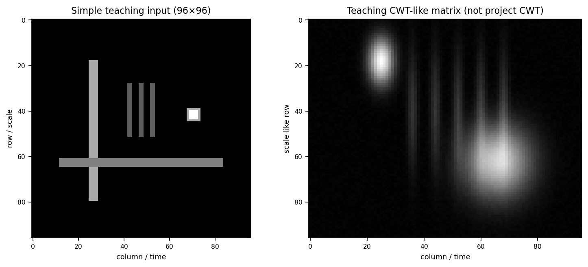
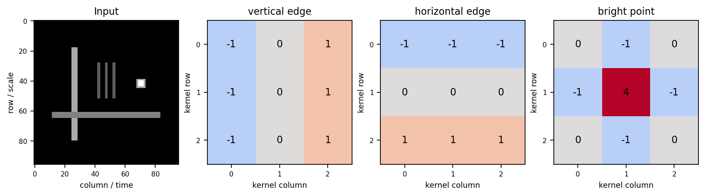
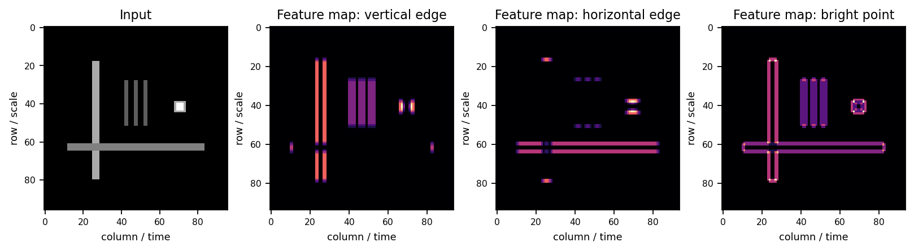
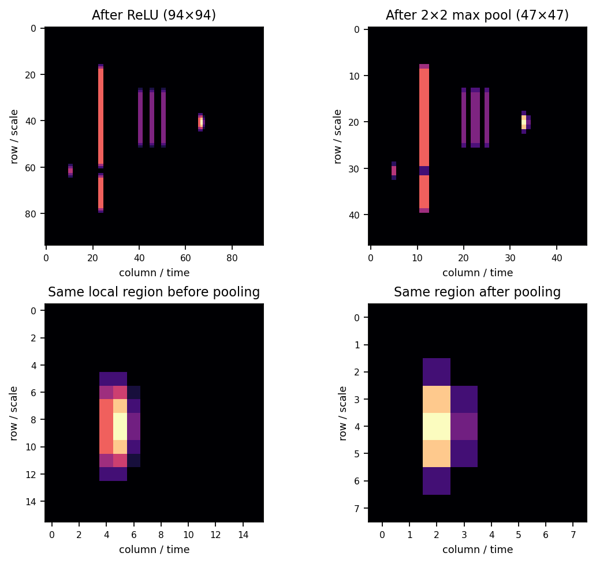

# Day 4｜理解 CNN 如何从 CWT 图像中提取故障特征

## 0. 本日边界：先把三种对象分开

本日教学线讨论的是：**`96×96` CWT 灰度图 + 2D CNN**。

当前工程的正式复现线讨论的是：**原始一维振动信号 + 1D WDCNN**。

工程检查得到的事实如下：

- `README.md` 的复现目标是 Zhang 等人的 WDCNN 论文，目标输入是 raw vibration signals。
- `src/models/wdcnn.py` 使用 `Conv1d`、`MaxPool1d`，默认输入形状为 `(batch, 1, 2048)`，不是二维 CWT 图像。
- `data/processed/` 中现有 `.npz` 是信号数组；本次检查没有发现已经生成的 `96×96` CWT 图片。
- 现有处理样例的信号数组形状为 `(200, 1024)`，这与 WDCNN 类的默认 `input_length=2048` 也不是同一个设置；这是工程配置问题，本日不改动它。

因此，本日的图像实验是**教学示例**：脚本构造了一个简单二维图案，并额外构造了一个“CWT-like”矩阵帮助建立视觉联系。它不是从工程数据计算出来的真实 CWT，也不代表论文声称 WDCNN 使用 CWT 输入。

---

## 1. 从 CWT 二维纹理到 CNN

前几天已经建立：CWT 把一维振动信号表示成 `scale × time` 系数矩阵，经过 `abs → min-max → resize → uint8` 后可形成灰度图。本日只接着问：**CNN 如何处理这张二维数值矩阵？**

一张图中的相邻像素不是互相独立的：相邻的时间位置通常对应相邻时刻，相邻的 scale 位置对应相邻尺度。于是，局部区域可能呈现出有结构的模式：

- 局部亮斑：某一时间、某一尺度附近的能量集中；
- 高频冲击纹理：短时间内快速出现的局部高频响应；
- 周期性竖纹：相似事件在时间方向重复出现；
- 能量带：一段尺度范围内持续或扩散的响应；
- 边缘、斜边和局部重复纹理：亮暗变化和邻域结构。

这些模式有两个特点，正好适合卷积：

1. **它们是局部的。** 判断一个小亮斑或边缘，通常先看附近几个像素，不需要一开始就看整张图。
2. **同一种模式可能出现在不同位置。** 冲击纹理可能出现在不同时间，能量结构也可能出现在不同 scale 区域。一个检测器可以在整张图上重复寻找它。

所以，CNN 适合的具体原因不是一句“CNN 擅长图像分类”，而是：CWT 将信号信息写成了有邻域关系的二维数值结构，而卷积可以用局部、可复用的模式检测器扫描这种结构。

必须保持一句边界：

> CNN 看到的不是“轴承”，而是一张二维数值矩阵中的局部结构。

它可能学到“某些亮斑、条纹、能量分布与某个标签经常同时出现”，但不会自动获得轴承结构、传递路径或故障形成过程的物理理解。



左图是卷积实验用的简单图案；右图只用于帮助观察“局部高频响应、较宽的低频响应、重复竖向能量痕迹”等视觉结构。右图明确是教学矩阵，不是工程 CWT。

---

## 2. 卷积核：一个可学习的局部模式检测器

### 2.1 直觉

一个 `3×3 kernel` 可以先理解成一个很小的模式检测器。它只看当前覆盖的 `3×3` 邻域：

```text
取一个 3×3 区域
    ↓
与 kernel 对应位置相乘
    ↓
把 9 个结果相加
    ↓
得到一个响应值
    ↓
向右移动，再计算下一处
```

它之所以叫**局部感受野**，是因为当前位置的输出只直接看到了输入中的一个小邻域。卷积核向右、向下扫描后，就能知道某种局部模式在不同位置出现得有多强。

同一个 kernel 会在整张图上重复使用，这叫**权重共享**。它表达的假设是：如果“竖向亮暗变化”在时间位置 20 有意义，那么在时间位置 70 出现时也可能有意义。这样做既能检测可重复模式，也显著减少参数；但它不等于所有位置的物理含义完全相同，scale 轴和 time 轴仍然要结合图像定义解释。

不同 kernel 的数值不同，因此可以寻找不同模式：一个偏好竖向变化，一个偏好横向变化，另一个偏好中心亮、四周暗的局部亮点。训练时，网络根据分类损失的反馈逐步调整这些数值，使“有助于区分标签的局部结构”得到更强响应。我们可以这样解释它们的功能，但不能声称人工指定了某个神经元必须代表某种故障。

### 2.2 一个很小的手算例子

下面用一个 `5×5` 输入和一个亮点检测 kernel，使用 valid 扫描说明过程。深度学习库通常实现的是 cross-correlation 形式；是否翻转 kernel 不影响本日的直觉。

```text
输入 X =
0 0 0 0 0
0 1 2 1 0
0 2 4 2 0
0 1 2 1 0
0 0 0 0 0

kernel K =
 0 -1  0
-1  4 -1
 0 -1  0
```

第一次取输入左上角的 `3×3` 区域时，中心值为 1，四个相邻值中有两个 2，因此响应为：

```text
4×1 - 2 - 2 = 0
```

当窗口移动到中间附近、覆盖中心亮点 4 时，响应为：

```text
4×4 - 2 - 2 - 2 - 2 = 8
```

于是这个 kernel 在中心亮点处响应更强，在平滑或不够突出的区域响应较弱。它不是在“识别轴承”，而是在检测一种局部数值关系：**中心是否比周围显著更亮**。



图中把三个固定 kernel 直接画出来：竖直边缘、水平边缘、亮点。它们是为了观察机制而人为设计的，不是训练后得到的 WDCNN 权重。

---

## 3. Feature map：一个 kernel 的扫描记录

关系要记成：

```text
输入图像
    ↓ 一个卷积核
一张 feature map
```

feature map 的每个位置记录：**这个 kernel 所寻找的局部模式，在输入图像对应位置的响应强弱**。

例如，一个竖直边缘 kernel 扫描 CWT 图：

```text
CWT 图某区域存在竖向亮暗变化
    ↓
该 kernel 与局部区域匹配得较好
    ↓
卷积响应较大
    ↓
feature map 对应位置较亮
```

因此，feature map 不是另一张原始图，也不是“故障概率图”。它是某一个检测器对各个空间位置的响应地图。图中亮的位置表示这个检测器在那里的证据更强；暗的位置表示证据较弱。若显示的是带正负号的原始响应，正负还可能表示相反方向的边缘或对比关系；教学图中为了直观看选择性，通常显示响应幅值或 ReLU 后响应。

通道数的关系是：

```text
1 个 kernel  →  1 张 feature map
32 个 kernel → 32 张 feature map
```

若输入是 `96×96×1`，使用 32 个 `3×3` kernel、stride=1、same padding 的第一层卷积，示意输出可写成 `96×96×32`。高度和宽度大体不变，但每一个通道代表一种不同的局部检测结果。



可以观察到：竖直边缘 kernel 主要点亮竖直结构，水平边缘 kernel 主要点亮水平结构，亮点 kernel 主要点亮局部突出的区域。同一输入经过不同 kernel 后，得到的不是同一张响应图。

---

## 4. ReLU：让网络具备“条件式激活”的非线性

卷积输出可能有正、有负。ReLU 的直觉过程是：

```text
卷积响应
    ↓
负响应不通过
正响应保留
```

但 ReLU 不能只记成“把负数删掉”。关键在于它提供了**非线性门控**：当某种模式的响应没有达到有效方向时，这个通道在该位置不激活；当模式证据足够强时，响应被保留下来并可继续传给下一层。

为什么需要非线性？如果每层都只是线性变换，那么多层线性变换合起来仍然只是一个线性变换，可以折叠成一层。网络即使写了很多层，也不会因此获得真正更丰富的分段决策能力。ReLU 插入后，网络可以表达“满足某种局部组合条件才继续激活”的关系。

负响应也不是普遍意义上的“错误信息”：它可能表示与该 kernel 偏好的对比方向相反。只是对当前这个通道来说，ReLU 选择不让这类响应继续通过；网络可以通过学习另一个符号相反或功能不同的 kernel 来表示另一种证据。

---

## 5. Pooling：牺牲精确位置，换取更粗粒度的显著性

以 `2×2 max pooling` 为例：

```text
96×96
   ↓ 每个 2×2 小块取最大值，stride=2
48×48
```

它保留：

- 一个小邻域中的较强响应；
- 模式大致出现在哪个区域；
- 对后续分类有用的显著纹理。

它损失：

- 精确像素位置；
- 部分弱响应和细节；
- 一半左右的空间分辨率（本例中每个方向减半）。

这种损失为什么可能有益？分类器通常不需要知道一条纹理精确落在第 53 个像素，知道“这个局部区域出现了这种故障相关纹理”就足够。池化也让特征对小范围位移更不敏感：纹理稍微移动时，仍可能落入同一个池化小块。

但 pooling 不是“信息越少越好”。过度池化会把短促冲击、窄能量带或相邻故障模式压得过于粗糙，导致本来有区分力的细节消失。是否适合，需要看输入尺寸、模式尺度和任务目标。

本实验的一个具体尺寸链是：人工卷积采用 valid `3×3`，所以 `96×96 → 94×94`；ReLU 不改变尺寸；再经 `2×2` max pooling 后为 `47×47`。如果正式模型采用 same padding，卷积后的尺寸会不同，但“局部响应 → ReLU → 下采样”的信息逻辑不变。



左上是 ReLU 后的响应，右上是池化后的粗粒度地图；下方对同一局部区域进行对照，可以看到局部峰值仍被保留，但空间细节变少。

---

## 6. 多层 CNN 为什么越来越抽象

可以用“组合”理解，而不是把某一层硬翻译成一个人工命名的物理部件：

```text
第一层卷积
    ↓
边缘、亮斑、短条纹、局部对比

第二层卷积
    ↓
把相邻低级响应组合成冲击纹理、能量带、重复结构

更深层
    ↓
组合更大范围、更复杂的统计模式

分类器
    ↓
根据最终特征表示输出类别
```

随着层数增加，一个深层单元间接覆盖的输入区域通常变大：它不只看一个像素或一个 `3×3` 邻域，而是看前面许多局部响应的组合。因此，深层表示通常比第一层更抽象、更难直接用一个简单图形描述。

用 CWT 图像的语言说：第一层可能对亮斑、边缘、竖纹产生响应；后续层可能对“某些时间间隔内反复出现、并在若干 scale 上共同出现的局部纹理组合”更敏感；最后分类器利用这些组合与标签的统计关联。

必须加上限制：

> “高层特征”是帮助人理解网络的解释性描述，并不意味着某个神经元被人工指定为“外圈故障检测器”。

实际特征是由训练数据、标签、损失函数、初始化和优化过程共同形成的统计表征。网络也可能利用负载、传感器位置、噪声或数据划分中的偶然线索。它得到高准确率，不自动等于学到了正确的故障机理。

---

## 7. 用统一的信息流框架看一遍

| 步骤 | 输入是什么 | 做了什么变换 | 输出是什么 | 保留了什么 | 损失了什么 | 为什么值得这样做 |
|---|---|---|---|---|---|---|
| 输入 | `96×96×1` CWT 灰度矩阵 | 把时间—尺度结构作为二维数值输入 | 单通道图像张量 | 局部亮度、邻域关系、二维位置 | 原始一维波形的直接形态；resize 后的精细尺度关系 | 让局部纹理可以被二维模型利用 |
| Conv | 图像或上一层 feature maps | 小 kernel 扫描、加权求和 | 多通道 feature maps | 与 kernel 匹配的局部模式及其位置 | 不同于 kernel 的细节被弱化或不响应 | 用局部检测器提取可复用证据 |
| ReLU | 带正负的卷积响应 | 对响应进行非线性门控 | 激活后的 feature maps | 强的正向模式证据、稀疏激活 | 当前通道的负向响应不再直接传递 | 让多层组合不再等价于一层线性变换 |
| Pooling | 激活后的局部响应 | 小窗口取最大值并下采样 | 更小的 feature maps | 显著响应和大致区域 | 精确位置、弱细节、空间分辨率 | 降低计算量并获得有限位移容忍度 |
| 更深卷积 | 多张低级 feature maps | 组合多个局部响应 | 更抽象的多通道表示 | 更大范围的纹理组合 | 逐步失去直接可视的像素含义 | 建立从简单模式到复杂统计模式的层级 |
| 分类器 | 最终特征表示 | 加权映射到类别分数 | 正常/内圈/外圈/滚动体等标签分数 | 与训练标签相关的判别信息 | 不能保证保留物理因果解释 | 完成监督分类任务 |

这张表中的“保留/损失”不是说每一步都绝对好或坏，而是在回答：**为了下一步任务，网络主动交换了什么信息。**

---

## 8. 当前工程中的 WDCNN：不要与本日 2D 教学线混淆

当前 `src/models/wdcnn.py` 的结构是 1D：

| 层 | kernel / stride | 通道或单元变化 | 当前代码中的长度变化 |
|---|---|---|---|
| 输入 | — | `1` 路原始信号 | `2048` |
| Conv1 | `64 / 16` | `1 → 16` | `2048 → 128` |
| Pool1 | `2 / 2` | `16` | `128 → 64` |
| Conv2 | `3 / 1` | `16 → 32` | `64 → 64` |
| Pool2 | `2 / 2` | `32` | `64 → 32` |
| Conv3 | `3 / 1` | `32 → 64` | `32 → 32` |
| Pool3 | `2 / 2` | `64` | `32 → 16` |
| Conv4 | `3 / 1` | `64 → 64` | `16 → 16` |
| Pool4 | `2 / 2` | `64` | `16 → 8` |
| Conv5 | `3 / 1` | `64 → 64` | `8 → 6` |
| Pool5 | `2 / 2` | `64` | `6 → 3` |
| FC1 / 输出 | — | `192 → 100 → 10` | 分类分数 |

这里的 `64` 是沿着一维振动序列看的大卷积核，不是 CWT 图上的 `64×64` 图像 kernel。当前 WDCNN 的“feature map”是多条一维特征序列；本日 2D CNN 的 feature map 是二维响应图。二者共享“局部感受野、权重共享、ReLU、pooling、逐层组合”的思想，但输入对象和空间维度不同。

因此，正确说法是：

> 本日用“CWT 二维图像 + 2D CNN”理解卷积机制；当前工程的 WDCNN 论文复现仍是“原始一维振动信号 + 1D CNN”。不能据此声称 WDCNN 论文使用了 CWT 图像输入。

---

## 9. 本日实验如何运行

脚本位置：`scripts/day4_cnn_visualization.py`

运行：

```powershell
D:/Anaconda3/python.exe scripts/day4_cnn_visualization.py
```

它只使用 NumPy 和 Matplotlib，完成以下动作：

1. 构造简单 `96×96` 输入：竖线、横线、重复局部条纹、亮点；
2. 定义三个人工 kernel：竖直边缘、水平边缘、亮点；
3. 用 valid 二维扫描生成响应图；
4. 对一个响应图执行 ReLU 和 `2×2` max pooling；
5. 保存四张图。

没有训练、没有调用正式 WDCNN、没有下载 CWRU 数据、没有写入 `src/`。

---

## 10. Day 4 八道验收题：先自行回答

1. 为什么 CWT 图像适合使用 CNN？
2. 一个 `3×3 kernel` 在图像上到底做了什么？
3. 为什么一个 kernel 会生成一张 feature map？
4. 32 个 kernel 为什么会得到 32 张 feature map？
5. ReLU 为什么不能简单理解成“把负数删掉”？
6. Pooling 保留了什么，又损失了什么？
7. 为什么 CNN 越往深层，特征通常越抽象？
8. CNN 为什么不能被表述成“理解了轴承故障机理”？

### 参考答案（单独区域）

1. CWT 图像中相邻的时间—尺度位置有局部结构，故障相关信息可能表现为亮斑、边缘、条纹、能量带和重复纹理；卷积核正好可以在整张二维矩阵上重复检测这些局部模式。
2. 它取一个 `3×3` 局部区域，与 kernel 逐元素相乘并求和，得到一个响应值，然后滑动到下一位置继续计算。它只直接看局部邻域，所以这个邻域是局部感受野。
3. 一个 kernel 在每个位置输出一个响应值，把所有位置的响应按原空间布局排列起来，就得到一张 feature map；它表示该 kernel 所寻找的模式在各位置的强弱。
4. 每个 kernel 有自己的一组权重、寻找一种模式，并产生一张独立的响应图；因此 32 个 kernel 通常产生 32 个输出通道，也就是 32 张 feature map。
5. ReLU 的重点不是机械删数，而是提供非线性门控：不符合当前通道方向的响应不激活，符合的响应继续传递。没有这种非线性，多层线性运算仍可合并成一个线性变换；同时负响应还可能表示相反方向的对比，只是当前通道选择不让它通过。
6. Pooling 保留局部区域内较强响应和大致位置，损失精确位置、弱细节和空间分辨率。适度损失可以换来小范围位移容忍和较低计算量；过度池化会丢掉关键冲击或窄能量带。
7. 浅层先产生边缘、亮斑等低级响应，后层再组合这些响应；随着层数增加，单元间接覆盖更大输入区域，所以通常形成更复杂、更难直接对应单个像素的统计表示。
8. CNN 只通过训练数据学习纹理与标签的统计映射，可能利用真正有用的故障相关模式，也可能利用负载、噪声或数据偏差。它没有被赋予轴承结构和因果机理知识，因此不能把分类表现直接表述成“理解了故障机理”。

---

## 11. Day 4 最终复述

> CWT 先把一维振动信号中的时间—尺度局部结构显式表示成二维纹理。CNN 中的卷积核相当于可学习的局部模式检测器，在整张图上寻找不同的亮斑、边缘、条纹和局部能量结构。每个卷积核生成一张 feature map，表示某种模式在不同位置的响应强度。经过 ReLU 和 pooling 后，网络逐渐压缩空间信息并保留显著特征；多层卷积再把简单纹理逐渐组合成更复杂的统计特征，最后用于故障分类。但 CNN 学习的是数据中纹理与标签之间的统计关系，并不知道这些纹理在物理上代表内圈、外圈或冲击机理。

如果这段话能独立复述，并且八题至少答对六题，Day 4 的认知目标就达到了。
